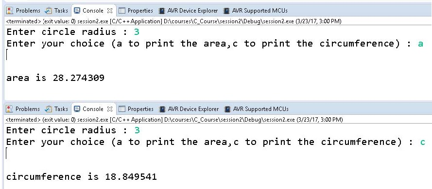
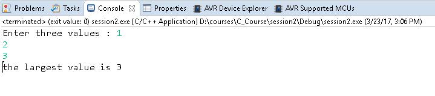
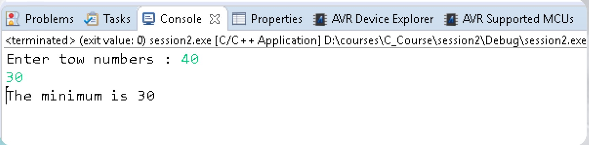
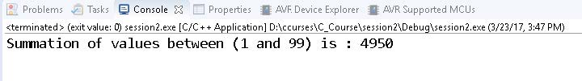
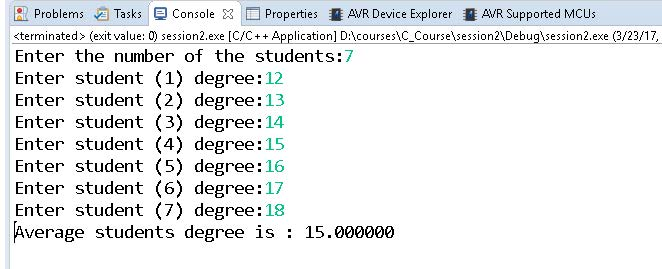
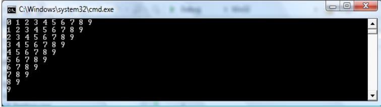

# Here I create a new folder for test and training with lecture3 labs (C_Basic) 

**Note:** I will use specific name for any Lab in next lectures Lab1_3_Cbasic (1 is Ex number , 3 is Lecture number ,Cbasic is topic name or short name)

## Lab 1 in slide page 50 lecture 3 pdf (C_basic)
Calculate Circle Area or Circumference

## Lab 2 in slide page 52 lecture 3 pdf (C_basic)
Comparing Three Numbers

## Lab 3 in slide page 55 lecture 3 pdf (C_basic)
Calculate the Minimumof Two Numbers

## Lab 4 in slide page 62 lecture 3 pdf (C_basic)
Calculate the Summation of values between 1 and 99

## Lab 5 in slide page 64 lecture 3 pdf (C_basic)
Calculate the Average Students Degrees

## Lab 6 in slide page 78 lecture 3 pdf (C_basic)
Write a program that produces the following output:

