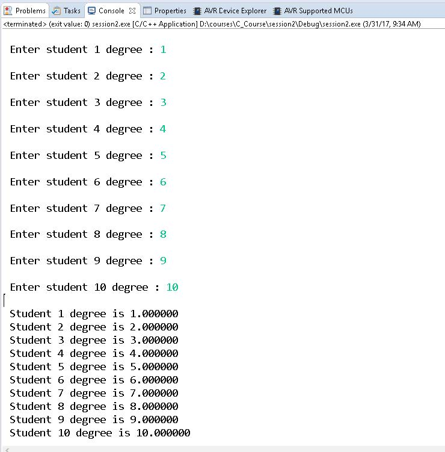
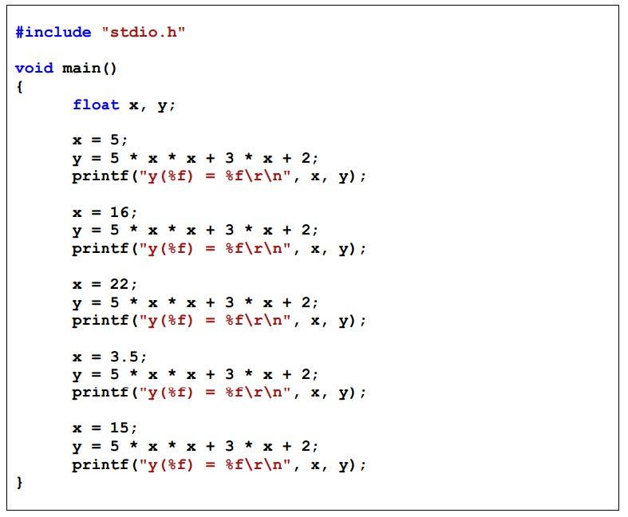
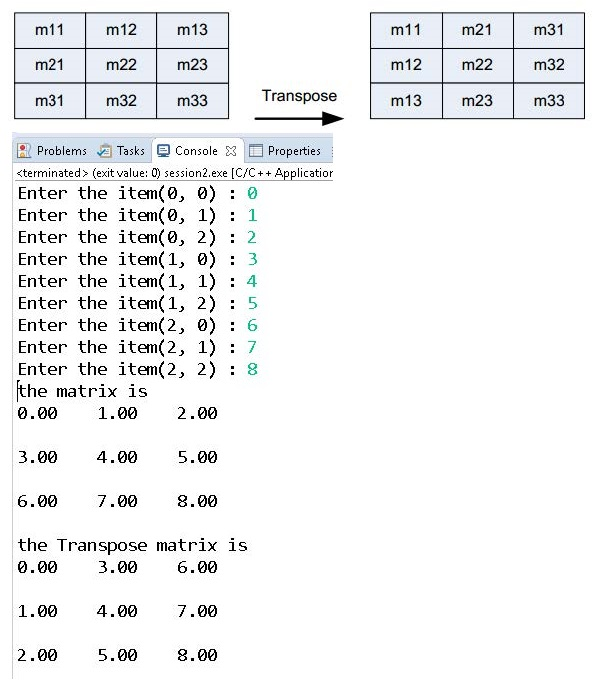

# test and training with lecture4 labs (C_Array) 

## Lab 1 in slide page 7

Store and Print 10 Students Degrees

## Lab 2 in slide page 12

CalculatePolynomial Value for a Set of Inputs

## Lab 3 in slide page 17

Calculate and Print the Transpose of 3x3 Matrix

End
------------------------------------------------------------