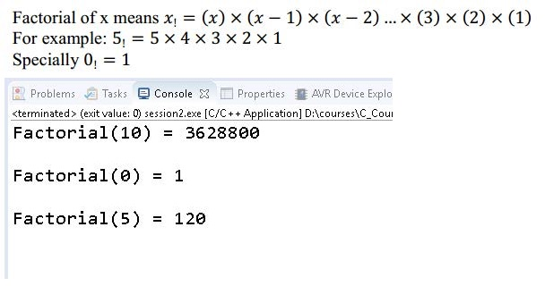
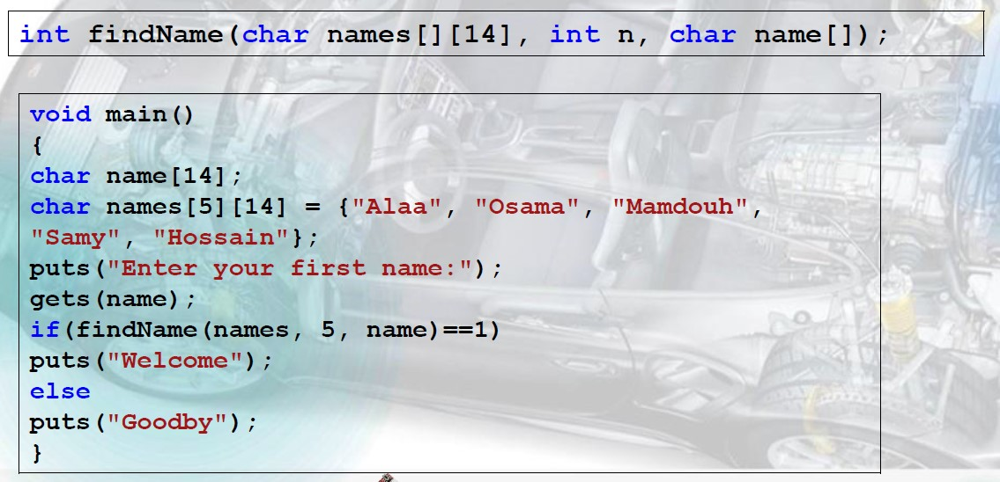

# Test and training with lecture 5 labs (C_Fenctions) 

## Lab 1 in slide page 11

Write a program uses a function to calculate the factorial of any positive number 

## Lab 2 in slide page 13

Calculatethe Minimum Value of any Given Array 

	int calcMin(int values[], int n) ;
	

## Lab 3 in slide page 15

Finding a Name in a Set of Names 

